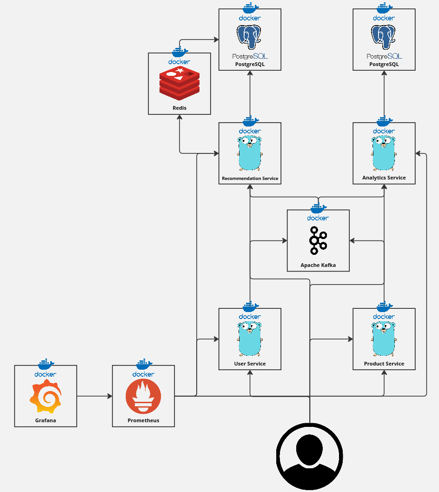
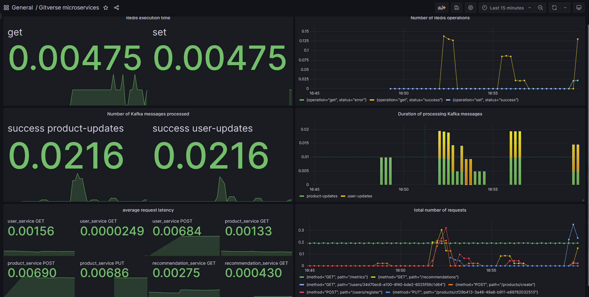

## Архитектура системы

Система состоит из следующих микросервисов:

1. Сервис пользователей:

   * Обеспечивает API для регистрации, получения и обновления информации о пользователях.

   * При изменении данных пользователя отправляет сообщения в Kafka в топик user-updates.

2. Сервис продуктов:

   * Обеспечивает API для управления продуктами (добавление, получение и обновление).

   * При изменении данных продукта отправляет сообщения в Kafka в топик product-updates.


3. Сервис рекомендаций:

   * Подписывается на топики user-updates и product-updates.

   * Генерирует рекомендации, основанные на популярности продуктов, и сохраняет их в базу данных (Postgres).

   * Обеспечивает API для получения рекомендаций.


4. Сервис аналитики:

   * Подписывается на топики user-updates и product-updates.

   * Собирает статистику по популярности продуктов и активности пользователей и сохраняет её в базу данных (Postgres).



## Взаимодействие между микросервисами

1. Пользовательские и продуктовые сервисы отправляют сообщения в Kafka при изменениях.

2. Сервис рекомендаций и сервис аналитики подписываются на Kafka и обновляют свои данные.

3. Сервис рекомендаций предоставляет данные через API.

4. Kafka:

   * Центральный механизм обмена сообщениями между микросервисами.

   * Топики:

     * user-updates: сообщения о действиях пользователей.

     * product-updates: сообщения об изменениях в продуктах.

5. Базы данных:

   * Используется Postgres для хранения данных.

   * Redis используется для кэширования в сервисе рекомендаций.

6. Мониторинг и логирование:

   * Каждый микросервис собирает метрики с помощью Prometheus (HTTP-запросы, события Kafka, взаимодействие с Redis).
   * Все метрики доступны через эндпоинт /metrics.
   * Визуализация осуществляется через Grafana.
   * Логирование выполнено с использованием стандартного пакета Go log и записывает ключевые события.
   
## Использованные технологии

1. Язык программирования: Golang

2. Брокер сообщений: Apache Kafka (Confluent Kafka)

   * Конфигурация:

      * bootstrap.servers: localhost:9091,localhost:9092,localhost:9093

3. База данных: Postgres

   * Конфигурация:

     * host: localhost

     * port: 5432

     * user: postgres

     * password: 1

     * dbname: postgres

4. Кэширование: Redis

   * Конфигурация:

     * address: localhost:6379

5. Веб-сервер: Gorilla Mux для обработки HTTP-запросов.

6. Мониторинг

   * Prometheus (сбор метрик)
   * Grafana (визуализация метрик)



## Инструкции по запуску

### Шаг 1: Установить зависимости

1. Убедитесь, что установлены:

   * Docker и Docker Compose.

   * Go (версии >= 1.23).

### Шаг 2: Запуск инфраструктуры

#### 1. Поднимите Kafka, Postgres, Redis, Prometheus, Grafana и микросервисы через Docker Compose:
```
docker-compose up -d
```

#### 2. Убедитесь, что все сервисы запущены и работают корректно:
```
docker ps

адреса по умолчанию:
User Service: http://localhost:8080

Product Service: http://localhost:8081

Recommendation Service: http://localhost:8082

Analytics Service: http://localhost:8083

Prometheus: http://localhost:9090

Grafana: http://localhost:3000
```
Войдите в Grafana (по умолчанию admin:admin) и добавьте Prometheus как источник данных.

#### 3. Опционально: запуск сервисов локально:
1. Запустите сервис пользователей:
    ```
    go run cmd/userService/main.go
    ```
2. Запустите сервис продуктов:
    ```
    go run cmd/productService/main.go
    ```
3. Запустите сервис рекомендаций:
    ```
    go run cmd/recommendationService/main.go
    ```
4. Запустите сервис аналитики:
    ```
   go run cmd/analyticsService/main.go
    ```
### Шаг 4: Тестирование API

1. Убедитесь, что API работают через Postman или cURL.

2. Примеры запросов:
   * Сервис пользователей:
    ```
    curl -X POST -H "Content-Type: application/json" -d '{"name": "John", "email": "john@example.com"}' http://localhost:8080/users/register
    ```
   * Сервис рекомендаций:
    ```
    curl -X GET "http://localhost:8082/recommendations"
    ```

## Тестирование системы

### 1. запуск тестов
```
go test ./...
```

## Контакты

Илья Милов - [@Manifure](https://t.me/Manifure) - manifure@gmail.com

School21 - Lainlynr

